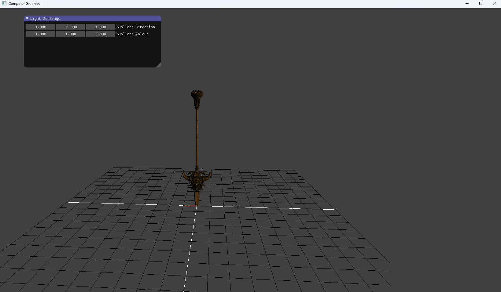

# OpenGL Graphics Assessment

**Key Features**

Real-time rendering using OpenGL

Vertex and fragment shader implementation

Transformation matrices (model, view, projection)

Rendering of geometric primitives

Basic camera and scene setup

Debugging and validation of rendering output

**Technologies Used**

C++

OpenGL

GLSL (Shader Programming)

Visual Studio

**My Contributions**

Implemented rendering logic using modern OpenGL

Wrote and integrated GLSL vertex and fragment shaders

Managed vertex buffers, vertex arrays, and draw calls

Implemented transformation pipelines using matrix math

Debugged rendering issues related to shaders, buffers, and state management

What This Project Demonstrates

Strong understanding of the graphics rendering pipeline

Ability to work close to the hardware via OpenGL

Shader programming experience with GLSL

Mathematical reasoning applied to real-time graphics

Clean, structured C++ code for rendering systems

**How to Build and Run**

Ensure you have a C++ compiler and OpenGL-compatible environment.

Clone the repository:

git clone https://github.com/VulnCollector/OpenGL-Graphics-Assessment.git

Open the solution in Visual Studio.

Build and run the project to view the rendered output.

**Screenshots**

